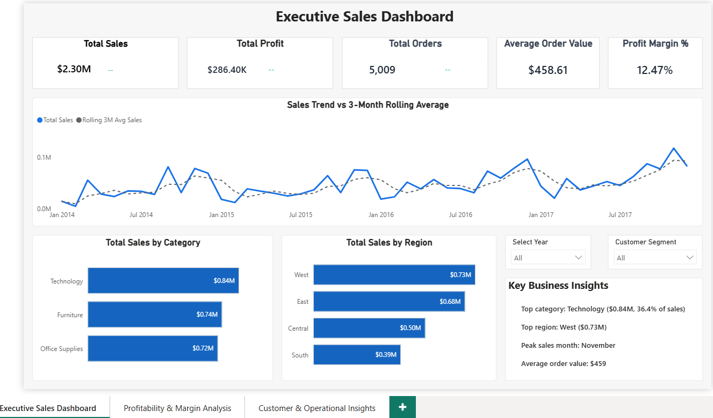
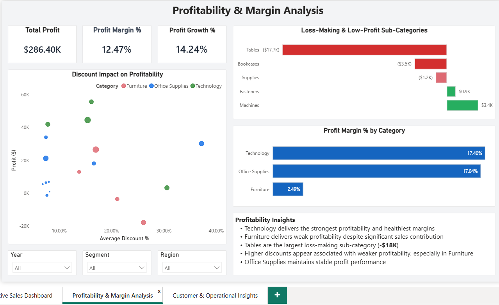
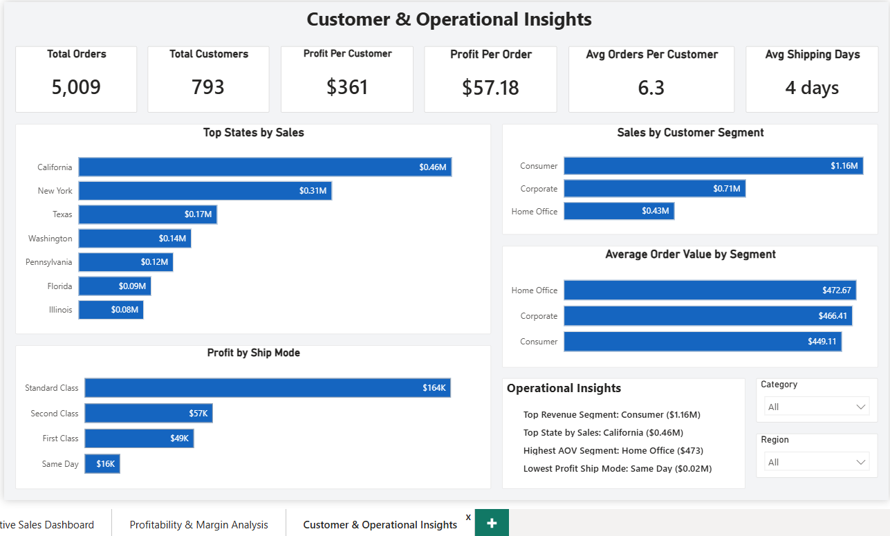

# Executive Sales Dashboard | Power BI

An interactive **Power BI dashboard** built to analyze sales performance, profitability, customer behavior, and operational metrics using the **Sample Superstore** retail dataset.

The report combines executive KPIs, dynamic DAX measures, time intelligence, and interactive visualizations to help decision-makers monitor business performance and uncover actionable insights.

---

## 📌 Project Overview

This project simulates an executive reporting solution for a retail business. It demonstrates how transactional sales data can be transformed into meaningful business insights through Power BI.

The dashboard focuses on answering questions such as:

- How are sales performing over time?
- Which products and regions generate the highest revenue?
- Which sub-categories negatively impact profitability?
- How do discounts affect profit?
- Which customer segments contribute the most revenue?
- What operational metrics should management monitor?

---

# 📊 Dashboard Screenshots

## 1. Executive Sales Dashboard



---

## 2. Profitability & Margin Analysis



---

## 3. Customer & Operational Insights



---

# 🚀 Dashboard Features

### Executive Sales Dashboard

- Executive KPI Cards
- Sales Trend Analysis
- 3-Month Rolling Average
- Sales by Category
- Sales by Region
- Dynamic Business Insights
- Interactive Slicers
- Year-over-Year (YoY) Growth

---

### Profitability & Margin Analysis

- Profit KPIs
- Profit Margin Analysis
- Discount vs Profit Analysis
- Loss-Making Sub-Categories
- Profit Margin by Category
- Dynamic Report Tooltips
- Profitability Insights

---

### Customer & Operational Insights

- Customer KPIs
- Sales by Customer Segment
- Average Order Value Analysis
- Top States by Sales
- Profit by Ship Mode
- Operational Insights

---

# 💡 Key Business Insights

- Technology is the highest revenue-generating category.
- West is the top-performing sales region.
- Tables are the largest loss-making sub-category.
- Higher discounts are associated with weaker profitability, particularly within Furniture.
- Consumer is the highest revenue-generating customer segment.
- Standard Class shipping contributes the highest overall profit.

---

# 🛠 Technical Highlights

- Star Schema Data Model
- Power Query for Data Transformation
- Dynamic DAX Measures
- Time Intelligence
- Year-over-Year (YoY) Analysis
- Rolling Average Calculations
- Interactive Slicers
- Dynamic Insight Cards
- Report Tooltips
- Cross-Filtering
- Executive Dashboard Design

---

# 📈 Skills Demonstrated

- Microsoft Power BI
- DAX
- Power Query
- Data Modeling
- Data Visualization
- Dashboard Design
- Business Intelligence
- KPI Development
- Time Intelligence
- Analytical Storytelling

---

# 🧰 Tools & Technologies

| Tool | Purpose |
|------|----------|
| Microsoft Power BI | Dashboard Development |
| Power Query | Data Cleaning & Transformation |
| DAX | Calculated Measures & Time Intelligence |
| Microsoft Excel | Data Source |

---

# 📂 Dataset

**Dataset:** Sample Superstore

This project uses the publicly available **Sample Superstore** retail dataset for educational and portfolio purposes.

---

# ▶️ How to Use

1. Download the repository.
2. Open **Executive Sales Dashboard.pbix** in Microsoft Power BI Desktop.
3. Interact with the dashboard using the available slicers and filters.
4. Hover over visuals to explore additional insights through custom tooltips.

---

# 📁 Repository Structure

```text
executive-sales-dashboard-powerbi/
│
├── Executive Sales Dashboard.pbix
├── README.md
├── LICENSE
│
└── images/
    ├── executive-sales-dashboard.png
    ├── profitability-margin-analysis.png
    └── customer-operational-insights.png
```

---

# 👨‍💻 About This Project

This project was developed to strengthen practical skills in:

- Business Intelligence
- Executive Dashboard Design
- DAX
- Data Modeling
- Analytical Storytelling

The focus was on building a clean, interactive dashboard that communicates business performance effectively rather than simply displaying charts.

---

# 📬 Connect With Me

If you have feedback, suggestions, or opportunities to collaborate, feel free to connect.

**Rahul**

- 💼 LinkedIn: *www.linkedin.com/in/rahul-54a6a8201*
- 🐙 GitHub: https://github.com/rk-analytics

---

## ⭐ If you found this project interesting, consider giving the repository a star.
